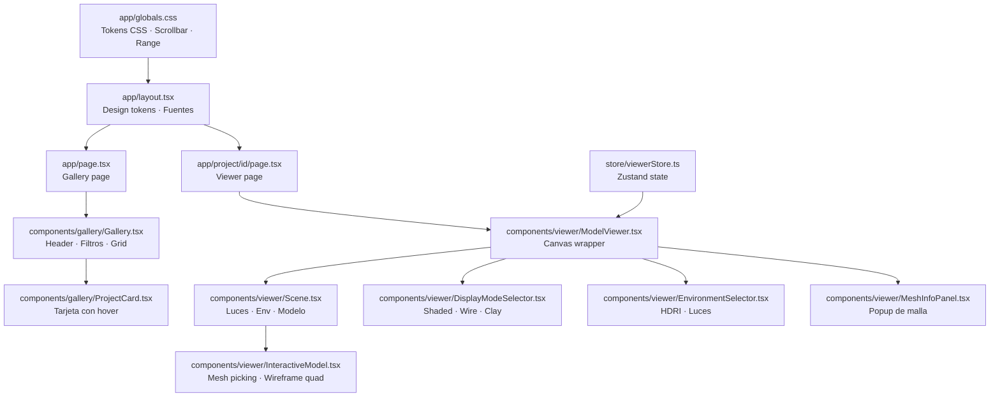
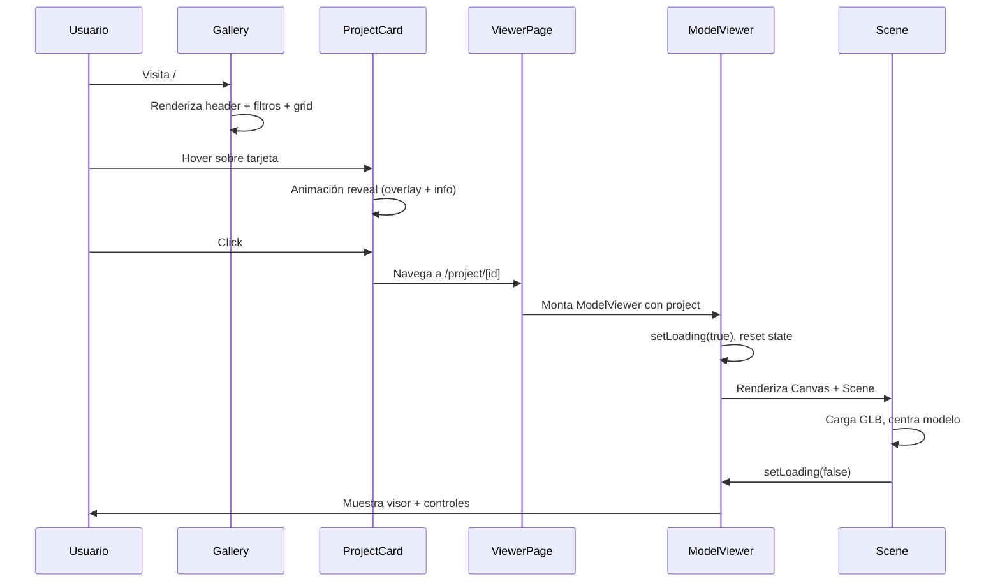
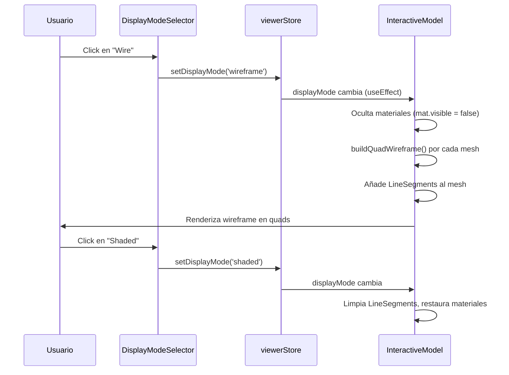

# Design Document: UI Visual Redesign

## Overview

Rediseño visual completo del portfolio 3D de Fer — una aplicación Next.js con visor de modelos 3D (React Three Fiber). El objetivo es elevar la identidad visual a algo más personal y profesional: una estética oscura, editorial y técnica que refleje el trabajo de un artista 3D serio, con mejoras concretas en la galería, el visor y el wireframe en quads.

El rediseño abarca tres capas: (1) sistema de diseño — tipografía, paleta de color, tokens CSS; (2) galería — layout, tarjetas, header; (3) visor 3D — controles, overlays, wireframe quad mejorado.

---

## Architecture



---

## Sequence Diagrams

### Flujo de navegación: Galería → Visor



### Flujo de cambio de modo de display



---

## Components and Interfaces

### Component 1: Design System (globals.css + layout.tsx)

**Purpose**: Centralizar tokens de diseño — paleta, tipografía, espaciado, efectos.

**Interface** (CSS custom properties):
```css
:root {
  /* Paleta base */
  --bg-base: #080808;
  --bg-surface: #0f0f0f;
  --bg-elevated: #161616;
  --bg-overlay: rgba(10, 10, 10, 0.92);

  /* Acento principal — violeta más saturado y personal */
  --accent: #8b5cf6;
  --accent-dim: #6d28d9;
  --accent-glow: rgba(139, 92, 246, 0.15);

  /* Texto */
  --text-primary: #f0f0f0;
  --text-secondary: #888;
  --text-muted: #444;

  /* Bordes */
  --border-subtle: rgba(255, 255, 255, 0.06);
  --border-medium: rgba(255, 255, 255, 0.12);

  /* Tipografía */
  --font-display: 'Space Grotesk', var(--font-geist-sans);
  --font-mono: var(--font-geist-mono);
}
```

**Responsabilidades**:
- Definir la paleta de color oscura con mayor contraste y personalidad
- Introducir Space Grotesk como fuente display para el nombre/título
- Mantener Geist Sans para UI y Geist Mono para datos técnicos
- Estilizar scrollbar y range inputs con los nuevos tokens

---

### Component 2: Gallery (Gallery.tsx)

**Purpose**: Página principal del portfolio — header personal + filtros + grid de proyectos.

**Interface**:
```typescript
// Sin cambios en props — solo visual
export default function Gallery(): JSX.Element
```

**Responsabilidades**:
- Header rediseñado: nombre grande con tipografía display, subtítulo más personal
- Añadir una línea decorativa / separador visual entre header y grid
- Filtros de categoría con estilo pill más refinado (borde sutil en estado inactivo)
- Grid con gap más generoso y posible variación de tamaño de tarjetas (featured card)

**Cambios visuales clave**:
- `"Fer."` → fuente display más grande, el punto en acento violeta con glow sutil
- Subtítulo: texto más personal, no solo descriptivo
- Filtros: estado activo con fondo sólido + borde, inactivo con borde sutil visible
- Fondo: gradiente radial muy sutil desde el centro para dar profundidad

---

### Component 3: ProjectCard (ProjectCard.tsx)

**Purpose**: Tarjeta de proyecto con thumbnail, hover reveal y metadata.

**Interface**:
```typescript
interface Props {
  project: Project;
  index: number;
  featured?: boolean; // nuevo: primera tarjeta puede ser más grande
}
```

**Responsabilidades**:
- Thumbnail con aspect ratio 4/3 (mantener)
- Overlay en hover más elaborado: gradiente más rico, info más legible
- Badge "3D" rediseñado: más técnico/editorial
- Badge de categoría: reemplazar fondo violeta sólido por borde + texto
- Hover: revelar título + descripción con mejor tipografía
- Below-card: añadir línea separadora sutil, mejorar jerarquía tipográfica

---

### Component 4: ViewerPage (app/project/[id]/page.tsx)

**Purpose**: Layout del visor — header, viewport 3D, sidebar de info.

**Interface**:
```typescript
// Sin cambios en props
export default function ProjectPage({ params }: Props): JSX.Element
```

**Responsabilidades**:
- Header: mejorar jerarquía visual, el título del proyecto más prominente
- Sidebar: añadir separadores visuales más claros, mejorar tipografía de metadata
- Tags: estilo más refinado con mejor contraste
- Breadcrumb "Portfolio ←": más sutil pero legible

---

### Component 5: DisplayModeSelector (DisplayModeSelector.tsx)

**Purpose**: Selector de modo de visualización 3D (Shaded / Wire / Clay).

**Interface**:
```typescript
// Sin cambios en props/store
export default function DisplayModeSelector(): JSX.Element
```

**Responsabilidades**:
- Rediseño del contenedor: separar los botones con más espacio, mejor feedback visual
- Iconos SVG mejorados para cada modo
- Estado activo: fondo con glow sutil en violeta, no solo tint
- Añadir tooltips accesibles (title + aria-label)

---

### Component 6: InteractiveModel — buildQuadWireframe (InteractiveModel.tsx)

**Purpose**: Renderizar wireframe que muestre solo aristas de quads, omitiendo diagonales de triangulación.

**Interface**:
```typescript
function buildQuadWireframe(geo: THREE.BufferGeometry): THREE.BufferGeometry

// Parámetros de configuración
const QUAD_WIRE_CONFIG = {
  SKIP_THRESHOLD: -Math.cos(30 * Math.PI / 180), // ≈ -0.866
  WIRE_COLOR: 0x7c6af7,   // violeta más cálido, coherente con el acento
  WIRE_OPACITY: 0.9,
}
```

**Responsabilidades**:
- Detectar y omitir diagonales de triangulación en superficies planas/suaves
- Mantener aristas de feature (diedro > 30°) y aristas de borde (boundary)
- Color del wireframe coherente con la paleta del redesign
- Mejorar el color de la línea: de `0x5577ff` (azul frío) a `0x7c6af7` (violeta)

---

## Data Models

### DesignToken (CSS custom properties)

```typescript
interface DesignTokens {
  // Colores de fondo (escala de oscuridad)
  bgBase: '#080808';
  bgSurface: '#0f0f0f';
  bgElevated: '#161616';

  // Acento
  accent: '#8b5cf6';
  accentDim: '#6d28d9';
  accentGlow: 'rgba(139, 92, 246, 0.15)';

  // Texto
  textPrimary: '#f0f0f0';
  textSecondary: '#888888';
  textMuted: '#444444';

  // Bordes
  borderSubtle: 'rgba(255,255,255,0.06)';
  borderMedium: 'rgba(255,255,255,0.12)';
}
```

**Reglas de validación**:
- Todos los colores de texto deben pasar WCAG AA (4.5:1) sobre el fondo base
- El acento violeta sobre fondo base: ratio ≥ 3:1 (para elementos decorativos grandes)
- Los bordes son siempre rgba para composición correcta sobre cualquier fondo

---

### WireframeConfig

```typescript
interface WireframeConfig {
  skipThreshold: number;   // cos del ángulo mínimo de diedro para conservar arista
  wireColor: number;       // color hex THREE.js
  wireOpacity: number;     // 0-1
  lineWidth: number;       // siempre 1 en WebGL (limitación del API)
}
```

**Reglas de validación**:
- `skipThreshold` debe estar en rango `[-1, 0)` — valores positivos eliminarían aristas reales
- `wireColor` debe ser un entero hex válido de 24 bits
- El algoritmo debe manejar geometrías no-indexadas con fallback a `WireframeGeometry`

---

## Algorithmic Pseudocode

### Algoritmo principal: buildQuadWireframe

```pascal
ALGORITHM buildQuadWireframe(geo)
INPUT: geo de tipo THREE.BufferGeometry (indexada)
OUTPUT: result de tipo THREE.BufferGeometry (solo aristas de quads)

PRECONDITIONS:
  - geo.attributes.position existe y es válido
  - geo.index puede ser null (fallback a WireframeGeometry)

POSTCONDITIONS:
  - result contiene solo pares de vértices (LineSegments)
  - Aristas de borde (1 triángulo adyacente) siempre incluidas
  - Aristas de feature (diedro > 30°) siempre incluidas
  - Diagonales de triangulación (diedro ≈ 0°) omitidas

BEGIN
  posAttr ← geo.attributes.position
  idx ← geo.index?.array

  IF idx IS NULL THEN
    RETURN new WireframeGeometry(geo)  // fallback
  END IF

  // Fase 1: Construir mapa de aristas
  edgeMap ← new Map<string, EdgeData>()

  FOR i ← 0 TO idx.length - 1 STEP 3 DO
    [a, b, c] ← [idx[i], idx[i+1], idx[i+2]]
    FOR EACH par [u, v, w] IN [[a,b,c], [b,c,a], [c,a,b]] DO
      k ← canonicalKey(u, v)  // min_max para evitar duplicados
      IF NOT edgeMap.has(k) THEN
        edgeMap.set(k, { u, v, others: [] })
      END IF
      edgeMap.get(k).others.push(w)
    END FOR
  END FOR

  // Fase 2: Filtrar aristas
  kept ← []

  FOR EACH edge IN edgeMap DO
    vU ← posAttr[edge.u]
    vV ← posAttr[edge.v]

    IF edge.others.length ≠ 2 THEN
      // Arista de borde → siempre conservar
      kept.push(vU, vV)
      CONTINUE
    END IF

    vP ← posAttr[edge.others[0]]
    vQ ← posAttr[edge.others[1]]
    edgeDir ← vV - vU

    // Normales de las dos caras adyacentes (relativas al eje de la arista)
    c1 ← edgeDir × (vP - vU)
    c2 ← edgeDir × (vQ - vU)

    IF |c1| < ε OR |c2| < ε THEN
      kept.push(vU, vV)  // triángulo degenerado → conservar
      CONTINUE
    END IF

    normalDot ← (c1 · c2) / (|c1| × |c2|)

    IF normalDot ≥ SKIP_THRESHOLD THEN
      // Diedro significativo (>30°) → arista real → conservar
      kept.push(vU, vV)
    END IF
    // else: superficie suave → diagonal de triangulación → omitir
  END FOR

  // Fase 3: Construir geometría resultado
  result ← new THREE.BufferGeometry()
  result.setAttribute('position', new Float32BufferAttribute(kept, 3))
  RETURN result
END
```

**Loop Invariants**:
- Al final de cada iteración del FOR de aristas: `kept` contiene solo aristas ya procesadas y aprobadas
- El `edgeMap` no se modifica durante la fase 2

---

### Algoritmo de aplicación de modo de display

```pascal
ALGORITHM applyDisplayMode(clonedScene, displayMode, originalProps, wireframeLines)
INPUT:
  clonedScene: THREE.Group
  displayMode: 'shaded' | 'wireframe' | 'clay'
  originalProps: Map<meshName, {color, roughness, metalness}>
  wireframeLines: WireframeLine[]
OUTPUT: void (mutación in-place de materiales)

PRECONDITIONS:
  - clonedScene está montado en el árbol de Three.js
  - originalProps contiene los valores originales de todos los meshes
  - wireframeLines está vacío al inicio (limpiado por el cleanup del efecto anterior)

POSTCONDITIONS:
  - Todos los meshes tienen el estado visual correcto para displayMode
  - wireframeLines contiene las líneas añadidas (solo en modo wireframe)
  - No hay fugas de memoria (geometrías/materiales sin dispose)

BEGIN
  clonedScene.traverse(obj):
    IF NOT obj.isMesh THEN CONTINUE END IF
    mesh ← obj as Mesh
    mat ← getMat(mesh)
    IF mat IS NULL THEN CONTINUE END IF

    // Reset estado transitorio del modo anterior
    mat.visible ← true
    mat.emissive.set(0, 0, 0)
    mat.emissiveIntensity ← 0

    CASE displayMode OF
      'wireframe':
        mat.visible ← false
        wireGeo ← buildQuadWireframe(mesh.geometry)
        linesMat ← new LineBasicMaterial({ color: WIRE_COLOR })
        lines ← new LineSegments(wireGeo, linesMat)
        mesh.add(lines)
        wireframeLines.push({ lines, geo: wireGeo, mat: linesMat })

      'clay':
        mat.color ← CLAY_COLOR
        mat.roughness ← 0.95
        mat.metalness ← 0

      'shaded':
        orig ← originalProps.get(mesh.name)
        IF orig IS NOT NULL THEN
          mat.color ← orig.color
          mat.roughness ← orig.roughness
          mat.metalness ← orig.metalness
        END IF
    END CASE
  END traverse

  // Cleanup registrado en el return del useEffect
  RETURN () =>
    FOR EACH { lines, geo, mat } IN wireframeLines DO
      lines.parent?.remove(lines)
      geo.dispose()
      mat.dispose()
    END FOR
    wireframeLines.clear()
END
```

---

## Key Functions with Formal Specifications

### buildQuadWireframe(geo)

```typescript
function buildQuadWireframe(geo: THREE.BufferGeometry): THREE.BufferGeometry
```

**Preconditions**:
- `geo.attributes.position` existe y tiene al menos 3 vértices
- Si `geo.index` es null, se acepta como geometría no-indexada

**Postconditions**:
- Retorna una `BufferGeometry` con atributo `position` de pares de vértices
- Toda arista de borde (1 triángulo adyacente) está incluida
- Toda arista con diedro > 30° está incluida
- Ninguna arista con `normalDot < SKIP_THRESHOLD` (diagonal suave) está incluida
- La geometría retornada no comparte referencias con `geo`

**Loop Invariants** (fase 2):
- `kept` solo contiene vértices de aristas ya evaluadas
- `edgeMap` es de solo lectura durante la iteración

---

### getMat(mesh)

```typescript
function getMat(mesh: THREE.Mesh): THREE.MeshStandardMaterial | null
```

**Preconditions**: `mesh` es un `THREE.Mesh` válido

**Postconditions**:
- Retorna el primer material si es `MeshStandardMaterial`, o `null` en caso contrario
- No muta el mesh ni el material

---

## Example Usage

```typescript
// Uso de buildQuadWireframe en InteractiveModel
if (displayMode === 'wireframe') {
  const wireGeo = buildQuadWireframe(mesh.geometry)
  const linesMat = new THREE.LineBasicMaterial({
    color: QUAD_WIRE_CONFIG.wireColor,   // 0x7c6af7 — violeta coherente con UI
  })
  const lines = new THREE.LineSegments(wireGeo, linesMat)
  mesh.add(lines)
  wireframeLines.current.push({ lines, geo: wireGeo, mat: linesMat })
}

// Uso de tokens de diseño en un componente
// globals.css define --accent: #8b5cf6
// Tailwind lo consume via @theme inline
// En JSX:
<button className="bg-[var(--accent)] hover:bg-[var(--accent-dim)] text-white px-4 py-2 rounded-lg">
  Acción
</button>

// ProjectCard con featured prop
<ProjectCard project={projects[0]} index={0} featured={true} />
// → renderiza con aspect-ratio 16/9 y texto más grande
```

---

## Correctness Properties

*A property is a characteristic or behavior that should hold true across all valid executions of a system — essentially, a formal statement about what the system should do. Properties serve as the bridge between human-readable specifications and machine-verifiable correctness guarantees.*

### Property 1: Wireframe edge correctness

*For any* indexed `BufferGeometry`, every edge in the result of `buildQuadWireframe` must be either a boundary edge (exactly one adjacent triangle) or a feature edge (dihedral angle > 30°), and no triangulation diagonal (dihedral angle ≤ 30° between coplanar faces) must appear in the result. The result must also contain no fewer edges than the count of boundary + feature edges in the input.

**Validates: Requirements 9.2, 9.3**

---

### Property 2: Wireframe result independence

*For any* `BufferGeometry` passed to `buildQuadWireframe`, the returned `BufferGeometry` must share no object references (position array, index array) with the input geometry.

**Validates: Requirements 9.5**

---

### Property 3: No memory leaks on mode transitions

*For any* sequence of display mode changes (including repeated transitions through wireframe, clay, and shaded), every `BufferGeometry` and `LineBasicMaterial` created during wireframe mode must have `dispose()` called and every `LineSegments` must be removed from its parent before or when the mode changes away from wireframe. This invariant must also hold when the `InteractiveModel` component unmounts.

**Validates: Requirements 10.1, 10.2, 10.3, 10.4**

---

### Property 4: Material restoration round-trip

*For any* set of meshes with arbitrary `color`, `roughness`, and `metalness` values, applying any display mode (wireframe or clay) and then switching to `'shaded'` must restore each mesh's material properties to exactly the values stored in `originalProps`, and each material's `visible` property must be `true`.

**Validates: Requirements 11.1, 11.2, 11.3**

---

### Property 5: WCAG AA contrast for all text tokens

*For any* text color token defined in the Design_System (`--text-primary`, `--text-secondary`, `--text-muted`), the WCAG relative luminance contrast ratio against `--bg-base` (`#080808`) must be at least 4.5:1.

**Validates: Requirements 1.6**

---

### Property 6: Filter active/inactive style invariant

*For any* set of category filters and any selected active filter, every inactive filter must render with a visible border style and no solid background fill, and the active filter must render with a solid background and a visible border — regardless of which category is selected.

**Validates: Requirements 4.2, 4.3**

---

### Property 7: DisplayModeSelector active/inactive glow invariant

*For any* display mode value (`'shaded'`, `'wireframe'`, `'clay'`), the button corresponding to the active mode must render with the violet glow style, and the two inactive buttons must render without the glow style.

**Validates: Requirements 8.2, 8.3**

---

### Property 8: DisplayModeSelector accessibility

*For any* display mode button rendered by `DisplayModeSelector`, the button must have a non-empty `aria-label` and a non-empty `title` attribute that describes the mode.

**Validates: Requirements 8.5**

---

### Property 9: DisplayModeSelector click dispatches correct mode

*For any* display mode button clicked in `DisplayModeSelector`, the `setDisplayMode` action on `viewerStore` must be called with exactly the mode value corresponding to that button.

**Validates: Requirements 8.6**

---

### Property 10: ProjectCard hover overlay visibility

*For any* `ProjectCard` with any project data, the overlay content (title and description) must be hidden when the card is not hovered, and visible when the card is hovered.

**Validates: Requirements 6.1, 6.2, 6.3**

---

### Property 11: viewerStore reactivity

*For any* `displayMode` value set on `viewerStore`, the Three.js scene managed by `InteractiveModel` must reflect the correct visual state for that mode (wireframe lines present ↔ mode is wireframe; clay material ↔ mode is clay; original materials ↔ mode is shaded).

**Validates: Requirements 12.2**

---

### Property 12: buildQuadWireframe memoization correctness

*For any* `BufferGeometry` with a given `uuid`, calling the memoized wrapper twice must return the same cached `BufferGeometry` instance on the second call without invoking the underlying `buildQuadWireframe` computation again.

**Validates: Requirements 13.1, 13.2**

---

## Error Handling

### Geometría no-indexada

**Condición**: `geo.index` es null (algunos modelos GLB exportan sin índices)
**Respuesta**: Fallback a `new THREE.WireframeGeometry(geo)` — muestra todas las aristas incluyendo diagonales
**Recovery**: El visor sigue funcionando; el wireframe es menos limpio pero funcional

### Material no-standard

**Condición**: Un mesh usa `MeshBasicMaterial` u otro tipo no-standard
**Respuesta**: `getMat()` retorna `null`; el mesh se omite en los efectos de display mode
**Recovery**: El mesh permanece visible con su material original sin modificar

### Modelo sin geometría indexada en algún mesh

**Condición**: Mesh individual sin índices dentro de un modelo mixto
**Respuesta**: Fallback por mesh individual, el resto del modelo usa quad wireframe
**Recovery**: Comportamiento degradado graciosamente por mesh

---

## Testing Strategy

### Unit Testing Approach

Probar `buildQuadWireframe` con geometrías sintéticas:
- Un quad plano (2 triángulos) → debe producir 4 aristas (el perímetro), no 5
- Un cubo (12 triángulos) → debe producir 12 aristas (las 12 aristas del cubo)
- Una esfera UV → debe producir solo las aristas de los meridianos/paralelos, no las diagonales

### Property-Based Testing Approach

**Property Test Library**: fast-check

```typescript
// Propiedad: toda arista en el resultado tiene exactamente 2 vértices
fc.assert(fc.property(
  arbitraryIndexedGeometry(),
  (geo) => {
    const result = buildQuadWireframe(geo)
    const positions = result.attributes.position
    return positions.count % 2 === 0
  }
))

// Propiedad: el resultado nunca tiene más aristas que la WireframeGeometry original
fc.assert(fc.property(
  arbitraryIndexedGeometry(),
  (geo) => {
    const quad = buildQuadWireframe(geo)
    const full = new THREE.WireframeGeometry(geo)
    return quad.attributes.position.count <= full.attributes.position.count
  }
))
```

### Integration Testing Approach

- Renderizar el visor con el modelo `cafe-lamp.glb` en modo wireframe y verificar que no hay errores de consola
- Cambiar entre los 3 modos de display y verificar que el estado visual es correcto en cada transición
- Verificar que el cleanup de `useEffect` no deja `LineSegments` huérfanos en la escena

---

## Performance Considerations

- `buildQuadWireframe` se ejecuta una vez por mesh al activar el modo wireframe. Para modelos con muchos meshes (>50), considerar memoizar el resultado por `geometry.uuid`.
- El `edgeMap` usa strings como claves (`"a_b"`). Para geometrías muy densas (>100k triángulos), considerar una clave numérica con hashing.
- Los tokens CSS custom properties no tienen impacto de rendimiento medible.
- Las animaciones de Framer Motion en la galería usan `transform` y `opacity` — propiedades que el navegador puede animar en el compositor sin reflow.

---

## Security Considerations

- Los modelos GLB se sirven desde `/public/models/` — archivos estáticos sin ejecución de código.
- No hay inputs de usuario que lleguen a Three.js sin sanitizar.
- Los tokens de diseño son valores CSS estáticos, sin interpolación dinámica de strings.

---

## Dependencies

**Existentes (sin cambios)**:
- `three` + `@react-three/fiber` + `@react-three/drei` — visor 3D
- `framer-motion` — animaciones de UI
- `zustand` — estado del visor
- `tailwindcss` v4 — utilidades CSS

**Nueva fuente (opcional)**:
- `Space Grotesk` via `next/font/google` — fuente display para el nombre/título del portfolio. Si se prefiere no añadir dependencias externas, se puede usar Geist Sans con ajustes de peso y tracking.
